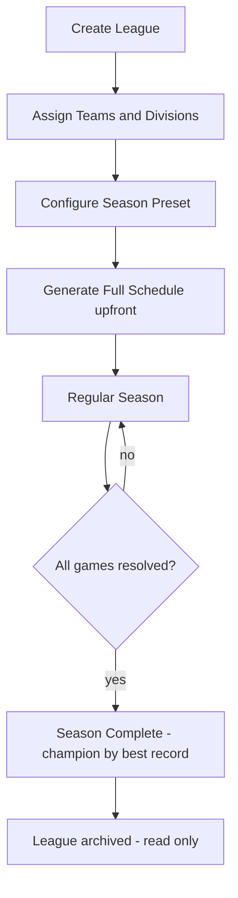

# League Mode — Implementation Reference

> **Status:** Pre-implementation planning docs. No code has been written yet.
> **Near-term scope (Phases 1–6):** league foundation, schedule, game modes, standings, and season completion. **Future phases (7+):** stats hub migration, trades, playoffs, multi-season — documented here for reference but not part of the initial implementation target.

---

## What Is League Mode?

League Mode adds a persistent, multi-team baseball league on top of the existing Exhibition engine. Users create a named league, assign custom teams to it, generate a round-robin schedule, and then play (or simulate) those games across a full season — all stored locally in RxDB with no server required.

A **Generate League** quick-start path lets users skip manual team creation entirely: pick a team count, an optional seed, and the app auto-generates fully-rostered named teams, assigns them to divisions, and creates the league in one tap. Generated teams are real persistent `TeamRecord` docs (reusable like any custom team).

### League Lifecycle

> **Future phases (7+):** Trade deadline enforcement → Playoff bracket → Multi-season rollover. These are documented in the relevant reference files but are not part of the initial implementation target.

---

## Key Decisions

| Topic                  | Decision                                                                                                                                                                                               | Phase          |
| ---------------------- | ------------------------------------------------------------------------------------------------------------------------------------------------------------------------------------------------------ | -------------- |
| DB migration strategy  | Epoch bump (`BETA_SCHEMA_EPOCH` `"v1.2"` → `"v1.3"`) — hard reset; intentional for this release                                                                                                        | 1 (near-term)  |
| Schedule structure     | Series-based (default 3 games per series); round-robin; see [schedule-algorithm.md](schedule-algorithm.md)                                                                                             | 2 (near-term)  |
| Division assignment    | Auto-assign evenly at league creation; user picks division count (0, 2, or 4); 0 = no divisions, single standings table                                                                                | 3 (near-term)  |
| Team exclusivity       | A team may only be in **one league at a time**; `activeLeagueId` persists for the life of league membership, cleared only when team leaves the league or the league is disbanded (not between seasons) | 1 (near-term)  |
| Season completion (v1) | Champion = team with best win percentage when all regular-season games resolve; no playoffs in initial slice                                                                                           | 6 (near-term)  |
| Trade deadline         | Stored in v1; default = midpoint of total game days; user-adjustable at creation; enforcement deferred to Phase 8                                                                                      | 8 (**future**) |
| Playoff format         | Configurable per league (Bo3 / Bo5 / Bo7, single bracket); defaults to **Bo5** if user makes no choice                                                                                                 | 9 (**future**) |
| Exhibition stats hub   | `/stats` becomes a **Stats Hub** (`/stats` → redirect → `/stats/exhibition`); league stats live at `/stats/league/:leagueId`                                                                           | 7 (**future**) |

> Items marked **future** are documented in this repo for reference, but are not part of the initial league-mode implementation target.

---

## Document Index

| Doc                                              | Contents                                                                                                 |
| ------------------------------------------------ | -------------------------------------------------------------------------------------------------------- |
| **This file**                                    | Decisions log, overview, phase summary                                                                   |
| [implementation-plan.md](implementation-plan.md) | Full implementation plan with per-phase checklists                                                       |
| [data-model.md](data-model.md)                   | New RxDB collections, schema definitions, ER diagram, epoch bump details                                 |
| [routing.md](routing.md)                         | New route table, before/after comparison, route tree diagram                                             |
| [gameplay-modes.md](gameplay-modes.md)           | Box Score / Watch / Simulate Day flows and Night Summary modal                                           |
| [schedule-algorithm.md](schedule-algorithm.md)   | Round-robin algorithm, series vs. one-off design, bye handling, division weighting, game seed uniqueness |
| [trades.md](trades.md)                           | Trade deadline enforcement, execution flow, roster constraints                                           |
| [playoffs.md](playoffs.md)                       | Playoff format options, bracket generation, series management                                            |
| [stats-migration.md](stats-migration.md)         | `/stats` → Stats Hub migration plan                                                                      |
| [stamina.md](stamina.md)                         | Fatigue model (within-game), v1 cross-game simplification, future pitcher rotation tracking              |
| [ai-manager-v2.md](ai-manager-v2.md)             | Future AI pre-game scope: rest-aware starter selection, batting order construction, bench strategy       |
| [edge-cases.md](edge-cases.md)                   | Edge cases and error handling across all areas of league play                                            |

---

## Phase Overview

| Phase | Name                          | Status        | Key Output                                                                                       |
| ----- | ----------------------------- | ------------- | ------------------------------------------------------------------------------------------------ |
| 1     | RxDB Collections              | **Near-term** | New schemas: `leagues`, `leagueSeasons`, `scheduledGames` (+ `tradeRecords` stub for future use) |
| 2     | Schedule Generator            | **Near-term** | Round-robin engine, series grouping, season presets                                              |
| 3     | Division Auto-Assignment      | **Near-term** | Even split by team count; 0/2/4 divisions                                                        |
| 4     | Feature Directory             | **Near-term** | `src/features/leagues/` scaffold — pages, components, storage                                    |
| 5     | Game Modes                    | **Near-term** | Box Score sim / Watch-and-Manage / Simulate Day                                                  |
| 6     | Standings & Season Completion | **Near-term** | Live standings, tiebreakers, champion by best record                                             |
| 7     | Stats Hub Migration           | _Future_      | `/stats` → Stats Hub; exhibition + league tabs                                                   |
| 8     | Trades                        | _Future_      | Roster moves, deadline gate, immutable trade records                                             |
| 9     | Playoffs                      | _Future_      | Bracket generation, series scheduling, champion crowning                                         |
| 10    | Multi-Season                  | _Future_      | Season rollover, historical browsing, new season start                                           |
| 11    | AI Manager v2                 | _Future_      | Rest-aware pitcher selection, batting order construction, bench strategy                         |

---

## Real-World Baseball League Gaps and Priorities

The docs in this directory describe a strong **league foundation** — not a full real-world baseball league simulation. The gaps below are **intentionally staged realism layers**. They are not missing because the design is incomplete; they are deferred so the core league ships cleanly. Future contributors should use this section to understand what "more realistic league play" means beyond the current scope.

### V1 — League Foundation _(Phases 1–6)_

These are the required pieces for league mode to function and feel like a real league:

- Persistent league entity with named teams and optional division structure
- Round-robin regular-season schedule generation
- Live standings and season completion (champion by best record)
- Watch / Simulate Day game flows
- Basic division support (0, 2, or 4 divisions)

> **Intentionally out of scope for v1:** calendar realism (off-days, home stands, travel rhythm), injury or player-availability systems, full roster-rule enforcement (active roster limits, IL designations), and deep pre-game AI decisions. These are not missing — they are deferred.

### V2 — Next Realism Layer _(Phases 7–11)_

After the foundation is stable, these bring the most meaningful realism improvements:

- **Cross-game pitcher usage** — starter rotation order, rest-day tracking, bullpen carryover / overuse effects (see [stamina.md](stamina.md))
- **Smarter pre-game AI decisions** — lineup construction, bench priority, rest-aware starter selection (see [ai-manager-v2.md](ai-manager-v2.md))
- **Richer postseason** — full playoff bracket, configurable series formats, champion crowning (see [playoffs.md](playoffs.md))
- **Season-to-season continuity** — multi-season history, rollover flows, historical stats browsing

### Beyond — Deeper League Simulation _(Later)_

Valuable additions, but deferred until the core league is proven stable:

- **Real calendar concepts** — off-days, home stands and road trips, travel rhythm, postponements / rainouts, doubleheaders
- **Player availability** — injury system, day-to-day and IL-style designations
- **Deeper roster rules** — active roster size limits, reserve / IL designations, call-up and transaction constraints
- **League history and flavor** — awards, records, milestones, rivalry tracking, franchise history, news / recaps / season flavor

---

## Key Constraints for Implementers

- **Team exclusivity** — at league creation, validate that every selected team has `activeLeagueId === null` in its `TeamRecord`. Write `activeLeagueId` on the team doc when the league is created. Clear it only when the team is explicitly removed from the league or the league is disbanded entirely — **not** between seasons. A team that is part of an ongoing multi-season league remains locked to that league across seasons.
- **RxDB schema changes** — the initial League Mode release uses an epoch bump (`BETA_SCHEMA_EPOCH` `"v1.2"` → `"v1.3"`), so all new collections start at `version: 0` with no migration strategies. Any **future** schema change to an existing league collection after launch must follow the full migration checklist in [`docs/rxdb-persistence.md`](../rxdb-persistence.md): bump `version`, add a migration strategy, write a unit test.
- **Headless sim** — the existing `GamePage` → `GameContext` → `reducer` pipeline must not be modified. The headless sim wraps the same reducer in a tight synchronous loop without React rendering; it takes `GameSaveSetup` and returns a `CompletedGameResult`.
- **Stats Hub** — the `/stats` route tree must redirect existing deep-links (`/stats/:teamId`, `/stats/:teamId/players/:playerId`) to their new `/stats/exhibition/...` equivalents so no bookmarked URLs break.
- **No IIFEs in JSX** — per project conventions; compute values as `const` before `return`.
- **Options-hash convention** — any function with more than 2 non-state/log parameters must use a named options object. See the Copilot instructions.
