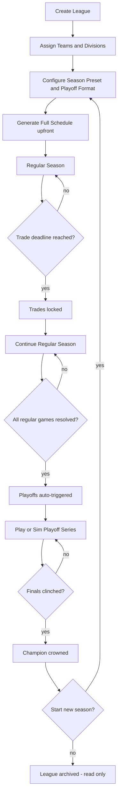

# League Mode — Implementation Reference

> **Status:** Pre-implementation planning docs. No code has been written yet.
> All decisions below are locked in and supersede anything in earlier design chat.

---

## What Is League Mode?

League Mode adds a persistent, multi-team baseball league on top of the existing Exhibition engine. Users create a named league, assign custom teams to it, generate a round-robin schedule, and then play (or simulate) those games across a full season, trade deadline, and playoffs — all stored locally in RxDB with no server required.

### League Lifecycle

---

## Locked-In Decisions

| Topic | Decision |
|---|---|
| Division assignment | Auto-assign evenly at league creation; user only picks the division count (2 or 4) |
| Trade deadline | Included; default = 50% of season game count; user-adjustable at creation |
| Playoff format | Configurable per league (Bo3 / Bo5 / Bo7, single bracket); defaults to **Bo5** if user makes no choice |
| Team exclusivity | A team may only be in **one active league at a time** |
| DB migration strategy | Epoch bump (`BETA_SCHEMA_EPOCH` `"v1.2"` → `"v1.3"`) — no per-collection migration strategies needed |
| Schedule structure | Series-based (default 3 games per series); see [schedule-algorithm.md](schedule-algorithm.md) |
| Exhibition stats | `/stats` becomes a **Stats Hub** (`/stats` → redirect → `/stats/exhibition`); league stats live at `/stats/league/:leagueId` |

---

## Document Index

| Doc | Contents |
|---|---|
| **This file** | Decisions log, overview, phase summary |
| [implementation-plan.md](implementation-plan.md) | Full 9-phase plan with per-phase checklists |
| [data-model.md](data-model.md) | New RxDB collections, schema definitions, ER diagram, epoch bump details |
| [routing.md](routing.md) | New route table, before/after comparison, route tree diagram |
| [gameplay-modes.md](gameplay-modes.md) | Box Score / Watch / Simulate Day flows and Night Summary modal |
| [schedule-algorithm.md](schedule-algorithm.md) | Round-robin algorithm, series vs. one-off design, bye handling, division weighting, game seed uniqueness |
| [trades.md](trades.md) | Trade deadline enforcement, execution flow, roster constraints |
| [playoffs.md](playoffs.md) | Playoff format options, bracket generation, series management |
| [stats-migration.md](stats-migration.md) | `/stats` → Stats Hub migration plan |
| [edge-cases.md](edge-cases.md) | Edge cases and error handling across all areas of league play |

---

## Phase Overview

| Phase | Name | Key Output |
|---|---|---|
| 1 | RxDB Collections | New schemas: `leagues`, `leagueSeasons`, `scheduledGames`, `tradeRecords` |
| 2 | Schedule Generator | Round-robin engine, series grouping, season presets |
| 3 | Division Auto-Assignment | Even split by team count at creation |
| 4 | Feature Directory | `src/features/leagues/` scaffold — pages, components, storage |
| 5 | Game Modes | Box Score sim / Watch-and-Manage / Simulate Day |
| 6 | Standings & Stats | Read-time standings, tiebreakers, Stats Hub routing |
| 7 | Trades | Roster moves, deadline gate, immutable trade records |
| 8 | Playoffs | Bracket generation, series scheduling, champion crowning |
| 9 | Multi-Season | Season rollover, historical browsing, new season start |

---

## Key Constraints for Implementers

- **Team exclusivity** — at league creation, validate that every selected team has `activeLeagueId === null` in its `TeamRecord`. Write `activeLeagueId` on the team doc when the league is created and clear it when the league season completes or the league is disbanded.
- **RxDB schema changes** — the initial League Mode release uses an epoch bump (`BETA_SCHEMA_EPOCH` `"v1.2"` → `"v1.3"`), so all new collections start at `version: 0` with no migration strategies. Any **future** schema change to an existing league collection after launch must follow the full migration checklist in [`docs/rxdb-persistence.md`](../rxdb-persistence.md): bump `version`, add a migration strategy, write a unit test.
- **Headless sim** — the existing `GamePage` → `GameContext` → `reducer` pipeline must not be modified. The headless sim wraps the same reducer in a tight synchronous loop without React rendering; it takes `GameSaveSetup` and returns a `CompletedGameResult`.
- **Stats Hub** — the `/stats` route tree must redirect existing deep-links (`/stats/:teamId`, `/stats/:teamId/players/:playerId`) to their new `/stats/exhibition/...` equivalents so no bookmarked URLs break.
- **No IIFEs in JSX** — per project conventions; compute values as `const` before `return`.
- **Options-hash convention** — any function with more than 2 non-state/log parameters must use a named options object. See the Copilot instructions.
