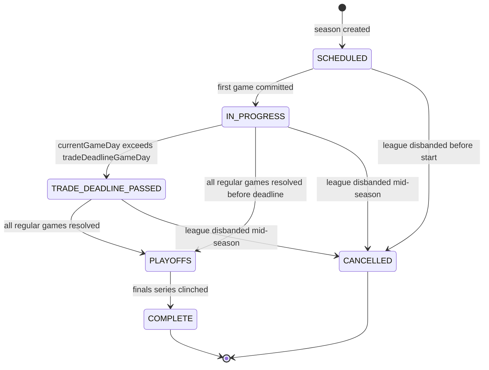
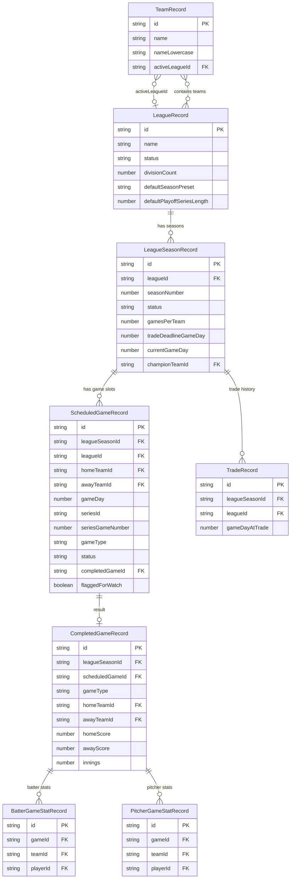

# League Mode — Data Model & DB Migration

> See [README.md](README.md) for decisions log. See [`docs/rxdb-persistence.md`](../rxdb-persistence.md) for the global RxDB rules.

---

## Overview of Changes to the DB

League Mode touches the RxDB layer in two ways:

| Change type | What changes | How handled |
|---|---|---|
| **Additive field on existing collection** | `teams` gets `activeLeagueId` | Epoch bump — field added at `version: 0`, no migration strategy needed |
| **Additive field on existing collection** | `completedGames` gets `leagueSeasonId`, `scheduledGameId`, `gameType` | Epoch bump — fields added at `version: 0`, no migration strategy needed |
| **New collections (net-new)** | `leagues`, `leagueSeasons`, `scheduledGames`, `tradeRecords` | Created fresh at `version: 0` — nothing to migrate |

---

## Chosen Approach: Epoch Bump

**Decision:** bump `BETA_SCHEMA_EPOCH` from `"v1.2"` to `"v1.3"`.

When the app loads and detects a different epoch string in `localStorage`, it **wipes the entire `ballgame` IndexedDB** and recreates it from scratch with the new schemas. All saves, custom teams, and exhibition stats are permanently deleted on the user's next app load.

### How it works

1. Change `BETA_SCHEMA_EPOCH = "v1.2"` → `"v1.3"` in `src/storage/db.ts` (one line).
2. Keep all existing collection schemas at their current `version: 0` — **no migration strategies needed anywhere**.
3. Add the four new league collections at `version: 0` with no migration strategies.
4. Done — RxDB sees a fresh DB with no legacy documents.

### Why this is correct for now

The app is in beta and the user base is small and aware that data may be reset. This is the accepted trade-off at this stage of development.

> ⚠️ **This is the last time the epoch mechanism can reasonably be used.** After League Mode ships, all future schema changes — including any later updates to the league collections themselves — **must** use `version` bumps and proper `migrationStrategies`. The epoch escape hatch must never be used again once real users have real league data.

### Future schema changes (post-launch)

Once League Mode is live, any change to any collection's `properties`, `required`, or `indexes` must follow the full migration checklist from [`docs/rxdb-persistence.md`](../rxdb-persistence.md):

1. Bump `version` in the collection's `RxJsonSchema`.
2. Add a `migrationStrategies` entry — a pure function, never throws, uses `?? default` on every new field.
3. Write a unit test that inserts a legacy doc, reopens the DB with the new schema, and asserts all fields migrate correctly.

Example for a future `leagueSeasons` v0 → v1 change:

```ts
export const leagueSeasonsV1CollectionConfig = {
  schema: { ...leagueSeasonsSchema, version: 1 },
  migrationStrategies: {
    1: (oldDoc: LeagueSeasonRecord) => ({
      ...oldDoc,
      newField: oldDoc.newField ?? "default",
    }),
  },
};
```

---

## Modified Existing Collections

### 1. `teams` — stays at version 0 (epoch-bumped)

**New field:** `activeLeagueId: string | null`  
**Purpose:** Enforces team exclusivity — a team may only be in one active league at a time.  
**Migration:** none required — epoch bump wipes the DB before these schemas are applied.

#### Updated TypeScript type (`src/features/customTeams/storage/types.ts`)

```ts
export interface TeamRecord {
  // ... all existing fields unchanged ...

  /**
   * FK → LeagueRecord.id of the league this team is currently active in.
   * null = the team is not in any active league and may be freely assigned.
   * Set at league creation; cleared only when the team is explicitly removed from the league
   * or the league is disbanded entirely. NOT cleared between seasons of the same league —
   * a team that belongs to an ongoing league remains locked to it across seasons.
   */
  activeLeagueId?: string | null;
}
```

#### Updated schema (`src/features/customTeams/storage/schemaV1.ts`)

```ts
const teamsSchemaV1: RxJsonSchema<TeamRecord> = {
  version: 0,           // unchanged — epoch bump handles the reset
  primaryKey: "id",
  type: "object",
  properties: {
    // ... all existing properties unchanged ...
    activeLeagueId: { type: ["string", "null"], maxLength: 128 },
  },
  required: ["id", "schemaVersion", "createdAt", "updatedAt", "name", "nameLowercase", "metadata"],
  indexes: ["updatedAt", "nameLowercase"],
};

export const teamsV1CollectionConfig = {
  schema: teamsSchemaV1,
  // No migrationStrategies — epoch bump produces a clean DB
};
```

---

### 2. `completedGames` — stays at version 0 (epoch-bumped)

**New fields:**
- `leagueSeasonId: string | null` — FK to `LeagueSeasonRecord.id`; null for exhibition games
- `scheduledGameId: string | null` — FK to `ScheduledGameRecord.id`; null for exhibition games
- `gameType: "EXHIBITION" | "LEAGUE_REGULAR" | "LEAGUE_PLAYOFF"` — discriminator for stats filtering

#### Updated TypeScript type (`src/features/careerStats/storage/types.ts`)

```ts
export interface CompletedGameRecord {
  // ... all existing fields unchanged ...

  /**
   * FK → LeagueSeasonRecord.id. null for exhibition games.
   * Present on any game played within a league context.
   */
  leagueSeasonId?: string | null;

  /**
   * FK → ScheduledGameRecord.id. null for exhibition games.
   * Links the result back to the scheduled slot for standings computation.
   */
  scheduledGameId?: string | null;

  /**
   * Discriminator for the type of game.
   * - "EXHIBITION" = one-off game outside any league
   * - "LEAGUE_REGULAR" = regular-season game in a league
   * - "LEAGUE_PLAYOFF" = playoff game in a league
   */
  gameType?: "EXHIBITION" | "LEAGUE_REGULAR" | "LEAGUE_PLAYOFF";
}
```

#### Updated schema (`src/features/careerStats/storage/schemaV1.ts`)

```ts
const completedGamesSchemaV1: RxJsonSchema<CompletedGameRecord> = {
  version: 0,           // unchanged — epoch bump handles the reset
  primaryKey: "id",
  type: "object",
  properties: {
    // ... all existing properties unchanged ...
    leagueSeasonId:  { type: ["string", "null"], maxLength: 128 },
    scheduledGameId: { type: ["string", "null"], maxLength: 128 },
    gameType: {
      type: "string",
      enum: ["EXHIBITION", "LEAGUE_REGULAR", "LEAGUE_PLAYOFF"],
      maxLength: 32,
    },
  },
  required: [
    "id", "playedAt", "seed", "rngState",
    "homeTeamId", "awayTeamId", "homeScore", "awayScore",
    "innings", "schemaVersion",
  ],
  indexes: [
    "playedAt",
    ["homeTeamId", "playedAt"],
    ["awayTeamId", "playedAt"],
    ["leagueSeasonId", "playedAt"],  // new index for standings queries
  ],
};

export const completedGamesV1CollectionConfig = {
  schema: completedGamesSchemaV1,
  // No migrationStrategies — epoch bump produces a clean DB
};
```

---

## New Collections

### 3. `leagues` — version 0 (net-new)

**Purpose:** League header — name, team membership list, division layout, season configuration defaults.

#### TypeScript type (`src/features/leagues/storage/types.ts`)

```ts
export type DivisionRecord = {
  id: string;        // e.g. "div_east", "div_west"
  name: string;
  teamIds: string[]; // ordered list of FK → TeamRecord.id
};

export interface LeagueRecord {
  /** Primary key — generated via generateLeagueId() from @storage/generateId */
  id: string;
  schemaVersion: number;
  createdAt: string;
  updatedAt: string;
  name: string;
  /** Lowercase name for O(1) indexed dedup lookup. */
  nameLowercase: string;
  /** All team IDs participating in this league (flat list; also present per-division). */
  teamIds: string[];
  /**
   * Division assignments. Length 2 or 4.
   * If the league has no divisions, this is an empty array [].
   */
  divisions: DivisionRecord[];
  /** Number of divisions (0 = no divisions, 2 or 4). */
  divisionCount: 0 | 2 | 4;
  /** Default season preset for new seasons in this league. */
  defaultSeasonPreset: "QUICK" | "SHORT" | "STANDARD" | "FULL" | "CUSTOM";
  /** Only meaningful when defaultSeasonPreset is "CUSTOM". */
  defaultCustomGameCount?: number;
  /** Default number of games per series (usually 3). */
  defaultSeriesLength: number;
  /** Default playoff format — applied to every new season unless overridden. */
  defaultPlayoffFormat: PlayoffFormat;
  /** Number of teams that advance to playoffs per season. */
  defaultPlayoffTeamCount: number;
  /** Whether to apply division-weighted scheduling (division rivals get ~1.4× matchups). */
  divisionWeightedSchedule: boolean;
  /** "ACTIVE" while at least one season is in progress; "INACTIVE" when no seasons are running. */
  status: "ACTIVE" | "INACTIVE";
}

export type PlayoffFormat = {
  seriesLength: 3 | 5 | 7;
  /** true = single-elimination bracket (default). false = double-elimination (future). */
  singleElimination: boolean;
};
```

#### RxDB Schema

```ts
const leaguesSchemaV1: RxJsonSchema<LeagueRecord> = {
  version: 0,
  primaryKey: "id",
  type: "object",
  properties: {
    id:                         { type: "string", maxLength: 128 },
    schemaVersion:              { type: "number", minimum: 0, maximum: 999, multipleOf: 1 },
    createdAt:                  { type: "string", maxLength: 32 },
    updatedAt:                  { type: "string", maxLength: 32 },
    name:                       { type: "string", maxLength: 256 },
    nameLowercase:              { type: "string", maxLength: 256 },
    teamIds:                    { type: "array", items: { type: "string" } },
    divisions:                  { type: "array", items: { type: "object", additionalProperties: true } },
    divisionCount:              { type: "number", enum: [0, 2, 4], multipleOf: 1 },
    defaultSeasonPreset:        { type: "string", maxLength: 32 },
    defaultCustomGameCount:     { type: "number", minimum: 4, maximum: 200, multipleOf: 1 },
    defaultSeriesLength:        { type: "number", minimum: 1, maximum: 7, multipleOf: 1 },
    defaultPlayoffFormat:       { type: "object", additionalProperties: true },
    defaultPlayoffTeamCount:    { type: "number", minimum: 2, maximum: 16, multipleOf: 1 },
    divisionWeightedSchedule:   { type: "boolean" },
    status:                     { type: "string", maxLength: 16 },
  },
  required: [
    "id", "schemaVersion", "createdAt", "updatedAt",
    "name", "nameLowercase", "teamIds", "divisions", "divisionCount",
    "defaultSeasonPreset", "defaultSeriesLength", "defaultPlayoffFormat",
    "defaultPlayoffTeamCount", "divisionWeightedSchedule", "status",
  ],
  indexes: ["updatedAt", "nameLowercase", "status"],
};
```

---

### 4. `leagueSeasons` — version 0 (net-new)

**Purpose:** One document per season of a league. Tracks schedule length, trade deadline, playoff config, and current status.

#### Season Status State Machine



#### TypeScript type

```ts
/**
 * Lifecycle status of a league season.
 * "SCHEDULED", "IN_PROGRESS", and "COMPLETE" are used in the initial (v1) implementation.
 * "TRADE_DEADLINE_PASSED" and "PLAYOFFS" are reserved for future phases.
 */
export type LeagueSeasonStatus =
  | "SCHEDULED"             // Created but no games played yet
  | "IN_PROGRESS"           // Regular season underway
  | "TRADE_DEADLINE_PASSED" // Future (Phase 8): past the deadline game-day threshold
  | "PLAYOFFS"              // Future (Phase 9): all regular-season games complete; playoffs running
  | "COMPLETE"              // Champion crowned, season over
  | "CANCELLED";            // League disbanded mid-season

export interface LeagueSeasonRecord {
  /** Primary key — e.g. "ls_<fnv1a>" from generateLeagueSeasonId() */
  id: string;
  schemaVersion: number;
  createdAt: string;
  updatedAt: string;
  /** FK → LeagueRecord.id */
  leagueId: string;
  /** 1-based season number within the league. */
  seasonNumber: number;
  /** Current lifecycle status. */
  status: LeagueSeasonStatus;
  /** Total regular-season games per team. */
  gamesPerTeam: number;
  /**
   * The game day number (1-based) after which trades are not allowed.
   * Future (Phase 8): game day after which trades are disallowed.
   */
  tradeDeadlineGameDay: number;
  /**
   * The current active game day — the game day currently being played.
   * Defined as the lowest game day number that still has at least one PENDING
   * ScheduledGameRecord. Advances to the next game day once all games on the
   * current day are COMPLETED or CANCELLED.
   * Starts at 1 when the season is created; 0 means no games have been played yet.
   */
  currentGameDay: number;
  /** Future (Phase 9): playoff series format. */
  playoffFormat: PlayoffFormat;
  /** Future (Phase 9): number of teams advancing to playoffs. */
  playoffTeamCount: number;
  /** FK → TeamRecord.id — set when status = "COMPLETE". null otherwise. */
  championTeamId: string | null;
  /**
   * Snapshot of team IDs and division assignments at season start.
   * Preserved so historical browsing shows the correct rosters even after
   * league membership changes in a later season.
   */
  teamIdsAtStart: string[];
  divisionsAtStart: DivisionRecord[];
}
```

#### RxDB Schema

```ts
const leagueSeasonsSchemaV1: RxJsonSchema<LeagueSeasonRecord> = {
  version: 0,
  primaryKey: "id",
  type: "object",
  properties: {
    id:                    { type: "string", maxLength: 128 },
    schemaVersion:         { type: "number", minimum: 0, maximum: 999, multipleOf: 1 },
    createdAt:             { type: "string", maxLength: 32 },
    updatedAt:             { type: "string", maxLength: 32 },
    leagueId:              { type: "string", maxLength: 128 },
    seasonNumber:          { type: "number", minimum: 1, maximum: 9999, multipleOf: 1 },
    status:                { type: "string", maxLength: 32 },
    gamesPerTeam:          { type: "number", minimum: 4, maximum: 200, multipleOf: 1 },
    tradeDeadlineGameDay:  { type: "number", minimum: 1, maximum: 200, multipleOf: 1 },
    currentGameDay:        { type: "number", minimum: 0, maximum: 200, multipleOf: 1 },
    playoffFormat:         { type: "object", additionalProperties: true },
    playoffTeamCount:      { type: "number", minimum: 2, maximum: 16, multipleOf: 1 },
    championTeamId:        { type: ["string", "null"], maxLength: 128 },
    teamIdsAtStart:        { type: "array", items: { type: "string" } },
    divisionsAtStart:      { type: "array", items: { type: "object", additionalProperties: true } },
  },
  required: [
    "id", "schemaVersion", "createdAt", "updatedAt",
    "leagueId", "seasonNumber", "status", "gamesPerTeam",
    "tradeDeadlineGameDay", "currentGameDay", "playoffFormat",
    "playoffTeamCount", "championTeamId", "teamIdsAtStart", "divisionsAtStart",
  ],
  indexes: ["leagueId", ["leagueId", "seasonNumber"], "status"],
};
```

---

### 5. `scheduledGames` — version 0 (net-new)

**Purpose:** One document per scheduled game slot. Both regular-season and playoff slots live in this collection; `gameType` discriminates.

#### TypeScript type

```ts
export type ScheduledGameStatus = "PENDING" | "COMPLETED" | "CANCELLED";

export interface ScheduledGameRecord {
  /** Primary key — e.g. "sg_<fnv1a>" from generateScheduledGameId() */
  id: string;
  schemaVersion: number;
  createdAt: string;
  updatedAt: string;
  /** FK → LeagueSeasonRecord.id */
  leagueSeasonId: string;
  /** FK → LeagueRecord.id (denormalized for query convenience). */
  leagueId: string;
  homeTeamId: string;
  awayTeamId: string;
  /** 1-based game day number — all games with the same gameDay are the "current day". */
  gameDay: number;
  /** Series identifier — groups all games in the same series (e.g. "series_teamA_teamB_1"). */
  seriesId: string;
  /** Game number within the series (1, 2, 3, etc.). */
  seriesGameNumber: number;
  gameType: "REGULAR" | "PLAYOFF";
  /** Playoff round number (1 = first round, 2 = semifinals, etc.). Only set when gameType = PLAYOFF. */
  playoffRound?: number;
  status: ScheduledGameStatus;
  /**
   * FK → CompletedGameRecord.id. Set when status = COMPLETED.
   * null when status is PENDING or CANCELLED.
   */
  completedGameId: string | null;
  /**
   * Result summary written at completion for quick display without joining completedGames.
   * null when status is PENDING or CANCELLED.
   */
  result: {
    homeScore: number;
    awayScore: number;
    innings: number;
    notableEvents?: string[];
  } | null;
  /**
   * Whether the user flagged this game to Watch/Manage instead of sim.
   * Bulk-simulate will prompt before simming a flagged game.
   */
  flaggedForWatch: boolean;
}
```

#### RxDB Schema

```ts
const scheduledGamesSchemaV1: RxJsonSchema<ScheduledGameRecord> = {
  version: 0,
  primaryKey: "id",
  type: "object",
  properties: {
    id:               { type: "string", maxLength: 128 },
    schemaVersion:    { type: "number", minimum: 0, maximum: 999, multipleOf: 1 },
    createdAt:        { type: "string", maxLength: 32 },
    updatedAt:        { type: "string", maxLength: 32 },
    leagueSeasonId:   { type: "string", maxLength: 128 },
    leagueId:         { type: "string", maxLength: 128 },
    homeTeamId:       { type: "string", maxLength: 128 },
    awayTeamId:       { type: "string", maxLength: 128 },
    gameDay:          { type: "number", minimum: 1, maximum: 999, multipleOf: 1 },
    seriesId:         { type: "string", maxLength: 256 },
    seriesGameNumber: { type: "number", minimum: 1, maximum: 7, multipleOf: 1 },
    gameType:         { type: "string", maxLength: 16 },
    playoffRound:     { type: "number", minimum: 1, maximum: 8, multipleOf: 1 },
    status:           { type: "string", maxLength: 16 },
    completedGameId:  { type: ["string", "null"], maxLength: 128 },
    result:           { type: ["object", "null"], additionalProperties: true },
    flaggedForWatch:  { type: "boolean" },
  },
  required: [
    "id", "schemaVersion", "createdAt", "updatedAt",
    "leagueSeasonId", "leagueId", "homeTeamId", "awayTeamId",
    "gameDay", "seriesId", "seriesGameNumber", "gameType",
    "status", "completedGameId", "result", "flaggedForWatch",
  ],
  indexes: [
    ["leagueSeasonId", "gameDay"],
    ["leagueSeasonId", "status"],
    ["seriesId", "seriesGameNumber"],
    "status",
  ],
};
```

---

### 6. `tradeRecords` — version 0 (net-new)

> *(Schema defined in Phase 1 for future compatibility — trade execution is deferred to Phase 8. See [trades.md](trades.md).)*

**Purpose:** Immutable audit log of every executed trade. Never updated after creation.

#### TypeScript type

```ts
export interface TradePlayerMove {
  playerId: string;
  nameAtTradeTime: string;
  fromTeamId: string;
  toTeamId: string;
}

export interface TradeRecord {
  /** Primary key — e.g. "tr_<fnv1a>" from generateTradeId() */
  id: string;
  schemaVersion: number;
  createdAt: string;
  /** FK → LeagueSeasonRecord.id */
  leagueSeasonId: string;
  /** FK → LeagueRecord.id (denormalized). */
  leagueId: string;
  /** The two team IDs involved in the trade. Always length 2. */
  teamIds: [string, string];
  /** Every player moved in the trade (can be 1-for-1 or multi-player). */
  playerMoves: TradePlayerMove[];
  /** Game day number at the time the trade was executed. */
  gameDayAtTrade: number;
  /**
   * How the trade record was created.
   * - "user" = normal trade executed via the trade UI
   * - "recovery" = auto-generated by validateLeagueRosterIntegrity to cover a partial-write failure
   */
  source: "user" | "recovery";
}
```

#### RxDB Schema

```ts
const tradeRecordsSchemaV1: RxJsonSchema<TradeRecord> = {
  version: 0,
  primaryKey: "id",
  type: "object",
  properties: {
    id:              { type: "string", maxLength: 128 },
    schemaVersion:   { type: "number", minimum: 0, maximum: 999, multipleOf: 1 },
    createdAt:       { type: "string", maxLength: 32 },
    leagueSeasonId:  { type: "string", maxLength: 128 },
    leagueId:        { type: "string", maxLength: 128 },
    teamIds:         { type: "array", items: { type: "string" }, minItems: 2, maxItems: 2 },
    playerMoves:     { type: "array", items: { type: "object", additionalProperties: true } },
    gameDayAtTrade:  { type: "number", minimum: 0, maximum: 9999, multipleOf: 1 },
    source:          { type: "string", enum: ["user", "recovery"], maxLength: 16 },
  },
  required: [
    "id", "schemaVersion", "createdAt",
    "leagueSeasonId", "leagueId", "teamIds", "playerMoves", "gameDayAtTrade", "source",
  ],
  indexes: ["leagueSeasonId", ["leagueId", "createdAt"]],
};
```

---

## `db.ts` Changes Summary

Three things change in `src/storage/db.ts`:

```ts
// 1. Add to DbCollections type
export type DbCollections = {
  saves:            RxCollection<SaveRecord>;
  events:           RxCollection<EventRecord>;
  teams:            RxCollection<TeamRecord>;
  players:          RxCollection<PlayerRecord>;
  completedGames:   RxCollection<CompletedGameRecord>;
  batterGameStats:  RxCollection<BatterGameStatRecord>;
  pitcherGameStats: RxCollection<PitcherGameStatRecord>;
  // ↓ New
  leagues:          RxCollection<LeagueRecord>;
  leagueSeasons:    RxCollection<LeagueSeasonRecord>;
  scheduledGames:   RxCollection<ScheduledGameRecord>;
  tradeRecords:     RxCollection<TradeRecord>;
};

// 2. Bump epoch — this wipes every user's local DB on next load
const BETA_SCHEMA_EPOCH = "v1.3";  // was "v1.2"

// 3. Add imports for new schema configs
import {
  leaguesV1CollectionConfig,
  leagueSeasonsV1CollectionConfig,
  scheduledGamesV1CollectionConfig,
  tradeRecordsV1CollectionConfig,
} from "@feat/leagues/storage/schemaV1";

// 4. Add to addCollections() call inside initDb() — existing collections unchanged
await db.addCollections({
  // ... existing collections at their current version: 0, no changes ...
  leagues:        leaguesV1CollectionConfig,
  leagueSeasons:  leagueSeasonsV1CollectionConfig,
  scheduledGames: scheduledGamesV1CollectionConfig,
  tradeRecords:   tradeRecordsV1CollectionConfig,
});
```

---

## `generateId.ts` Changes

Add three new ID generators to `src/storage/generateId.ts` (alongside existing `generateTeamId`, `generateSaveId`, etc.):

```ts
export const generateLeagueId        = () => `lg_${generateId()}`;
export const generateLeagueSeasonId  = () => `ls_${generateId()}`;
export const generateScheduledGameId = () => `sg_${generateId()}`;
export const generateTradeId         = () => `tr_${generateId()}`;
```

---

## ER Diagram



---

> **Note for future implementers:** The migration test pattern section has been intentionally removed — it only applies when using per-collection migration strategies (Option B). Since we are using an epoch bump, no migration tests are required for this release. If League Mode ever needs a schema update post-launch, refer to `docs/rxdb-persistence.md` for the migration test pattern to follow at that time.
