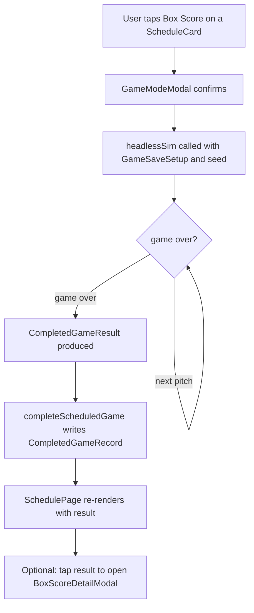
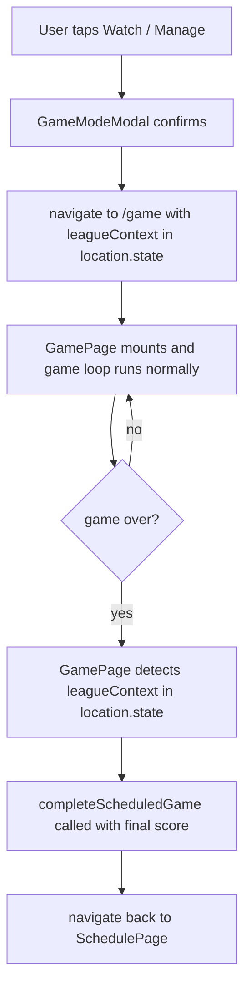
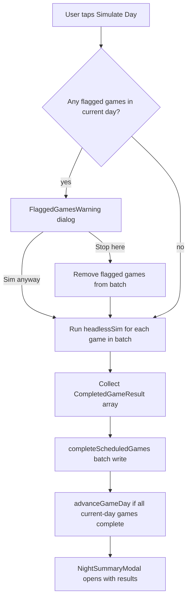

# League Mode — Gameplay Modes

> See [README.md](README.md) for decisions log and [implementation-plan.md](implementation-plan.md) for Phase 5 details.

---

## The Three Game Modes

Every scheduled game in a league has three possible engagement modes. The user picks a mode via the **GameModeModal** before play begins.

| Mode               | User involvement                                           | Speed      |
| ------------------ | ---------------------------------------------------------- | ---------- |
| **Box Score**      | None — headless sim runs instantly                         | < 1 second |
| **Watch / Manage** | Full interactive game at `/game`                           | Minutes    |
| **Skip / Forfeit** | Neither team plays; game cancelled with no result recorded | Instant    |

Games can also be advanced in bulk via **Simulate Day**, which runs Box Score mode across multiple games at once.

---

## Mode 1 — Box Score (Headless Sim)

### What it is

A synchronous, renderless run of the existing game `reducer` from `initialState` to `gameOver`. No React. No RxDB side effects during the run. Just pure simulation.

### Flow



### Seed Strategy

Each game's simulation seed is derived deterministically from the game's identity:

```ts
const seed = `${leagueSeasonId}:${scheduledGameId}`;
```

**Uniqueness guarantee:** `scheduledGameId` is an RxDB primary key — no two `ScheduledGameRecord` docs can share one. This means every game in every season has a unique seed. No manual deduplication is needed.

**Batched simulation:** When Simulate Day runs multiple games in the same call, each game derives its seed from its own `scheduledGameId` and calls `reinitSeed` before executing. Because gameplay randomness flows through the module-global PRNG in `@shared/utils/rng`, `headlessSim` calls are **sequential and non-reentrant** — they must not run concurrently. Within a single Simulate Day batch, games execute one after another in a deterministic order.

**Deterministic replay:** The same `leagueSeasonId:scheduledGameId` pair always produces the same game result. If the app crashes mid-batch, any unwritten games can be re-simulated and will produce identical results. The seed is stored on the resulting `CompletedGameRecord` for future verification.

See [schedule-algorithm.md — Game Seed Uniqueness](schedule-algorithm.md#game-seed-uniqueness) for the full reasoning.

### `headlessSim` API

```ts
interface HeadlessSimOptions {
  setup: GameSaveSetup;
  seed: string;
  maxIterations?: number; // safety cap; default 10_000
}

interface CompletedGameResult {
  homeScore: number;
  awayScore: number;
  innings: number;
  seed: string;
  rngState: number | null;
  boxScore: BoxScoreData;
  /** Short highlight strings for the Night Summary modal (e.g. "HR: J. Smith (2)", "No-hitter through 7"). */
  notableEvents: string[];
}

function headlessSim(options: HeadlessSimOptions): CompletedGameResult;
```

The `maxIterations` guard prevents an infinite loop if the reducer ever enters a pathological state. If hit, it should throw a descriptive error with the current state — not silently return a partial result.

---

## Mode 2 — Watch / Manage

### What it is

The user plays the game interactively through the existing `/game` route, exactly like an exhibition game. The only difference is that `location.state` carries a `leagueContext` object, and `GamePage` uses it to commit the result back to the league on `gameOver`.

### Flow



### `GameLocationState` extension

```ts
// Existing type in src/storage/types.ts — add leagueContext
export type LeagueGameContext = {
  leagueId: string;
  seasonId: string;
  scheduledGameId: string;
};

export type GameLocationState = {
  pendingGameSetup: ExhibitionGameSetup | null;
  pendingLoadSave: SaveRecord | null;
  leagueContext?: LeagueGameContext; // undefined = exhibition
} | null;
```

### In `GamePage`

```ts
// After gameOver fires:
const locationState = useLocation().state as GameLocationState;

if (locationState?.leagueContext) {
  const { scheduledGameId } = locationState.leagueContext;
  await scheduleStore.completeScheduledGame(scheduledGameId, {
    homeScore: state.score[1],
    awayScore: state.score[0],
    innings: state.inning,
    completedGameId: state.gameInstanceId,
  });
  navigate(`/leagues/${leagueId}/seasons/${seasonId}/schedule`, { replace: true });
} else {
  // existing exhibition post-game behavior
}
```

---

## Mode 3 — Simulate Day (Bulk)

### What it is

The user taps a single **"Simulate Day"** button on the `SchedulePage`. All unflagged PENDING games in the current game day are run through `headlessSim` in sequence. Each game's result is written individually (best-effort, sequential commits) — a failed write leaves that game PENDING while successfully written games stay completed. After the batch finishes, a **Night Summary modal** slides up showing all box scores that were saved.

"Current game day" is defined as all `ScheduledGameRecord` docs in the same `leagueSeasonId` with the same `gameDay` value equal to `leagueSeason.currentGameDay`.

### Default vs. Advanced Override

| Mode         | How triggered                   | Scope                                                                |
| ------------ | ------------------------------- | -------------------------------------------------------------------- |
| **Default**  | "Simulate Day" button           | All unflagged PENDING games on `currentGameDay`                      |
| **Advanced** | Checkbox toggle on SchedulePage | User selects exactly which games to include from any future game day |

The advanced override is surfaced via a "Select games" toggle that reveals checkboxes on each `ScheduleCard`. Once at least one is checked, the button label changes from "Simulate Day" to "Simulate Selected (N)".

### Flagged Game Handling

When a game has `flaggedForWatch: true`, Simulate Day treats it as follows:

1. Before starting, scan the selected games for any flagged ones.
2. If any flagged games are in the batch, show a **FlaggedGamesWarning** dialog listing them by matchup.
3. User can either: **"Sim anyway"** (proceeds and clears the flag), or **"Stop here"** (removes flagged games from the batch and only sims the others).

### Simulate Day Flow



### `useBulkSimulate` Hook

```ts
interface BulkSimulateOptions {
  games: ScheduledGameRecord[];
  onProgress?: (completed: number, total: number) => void;
}

interface BulkSimulateResult {
  results: Array<{ game: ScheduledGameRecord; result: CompletedGameResult }>;
  skippedFlagged: ScheduledGameRecord[];
}

function useBulkSimulate(): {
  simulate: (options: BulkSimulateOptions) => Promise<BulkSimulateResult>;
  isSimulating: boolean;
};
```

---

## Night Summary Modal

After a Simulate Day run completes, `NightSummaryModal` opens over the `SchedulePage`.

### Layout

```
┌─────────────────────────────────────────────┐
│  Tonight's Results                    [✕]   │
├─────────────────────────────────────────────┤
│  ┌──────────────────────────────────────┐   │
│  │  Hawks  7 — Wolves  3     (9 inn)    │   │
│  │  ⚡ HR: Rivera (2),  K: 12 combined  │   │
│  │                          [Box Score] │   │
│  └──────────────────────────────────────┘   │
│  ┌──────────────────────────────────────┐   │
│  │  Comets  2 — Bolts  2 F/10  (extras) │   │
│  │  ⚡ Walk-off double: Gupta            │   │
│  │                          [Box Score] │   │
│  └──────────────────────────────────────┘   │
│  ... (one card per game simulated)          │
├─────────────────────────────────────────────┤
│           [Back to Schedule]                │
└─────────────────────────────────────────────┘
```

### Notable Event Strings

The `headlessSim` function returns a `notableEvents: string[]` array. These are generated by scanning the completed game log for:

| Condition                | Example string                |
| ------------------------ | ----------------------------- |
| Home run                 | `"HR: J. Smith (3rd)"`        |
| No-hitter                | `"No-hitter: Rivera (CG)"`    |
| Walk-off                 | `"Walk-off: G. Patel double"` |
| Extra innings            | `"Extras: went 12 innings"`   |
| High-K game              | `"K: 15 combined strikeouts"` |
| Shutout                  | `"Shutout: Hawks blanked 0"`  |
| Blowout (≥10 run margin) | `"Blowout: +11 run margin"`   |

Keep these to a max of 3 per game card to avoid overflow.

---

## `ScheduleCard` Component

Each scheduled game slot is rendered as a `ScheduleCard`:

```
┌──────────────────────────────────────┐
│  Hawks            vs           Wolves │
│  Game 1 of 3 · Day 4                 │
│                                      │
│  [📺 Watch]  [⚡ Sim]  [⭐ Flag]     │  ← PENDING
└──────────────────────────────────────┘

┌──────────────────────────────────────┐
│  Hawks  7 ·────────────· 3  Wolves   │
│  Final (9)  · Day 4                  │
│                          [Box Score] │  ← COMPLETED
└──────────────────────────────────────┘
```

- **📺 Watch** — sets `flaggedForWatch: true` and opens `GameModeModal` in Watch mode
- **⚡ Sim** — immediately runs `headlessSim` for this single game (no modal)
- **⭐ Flag** — toggles `flaggedForWatch` without starting play (saves for Watch mode later)
- **Box Score** — opens `BoxScoreDetailModal` for a completed game
