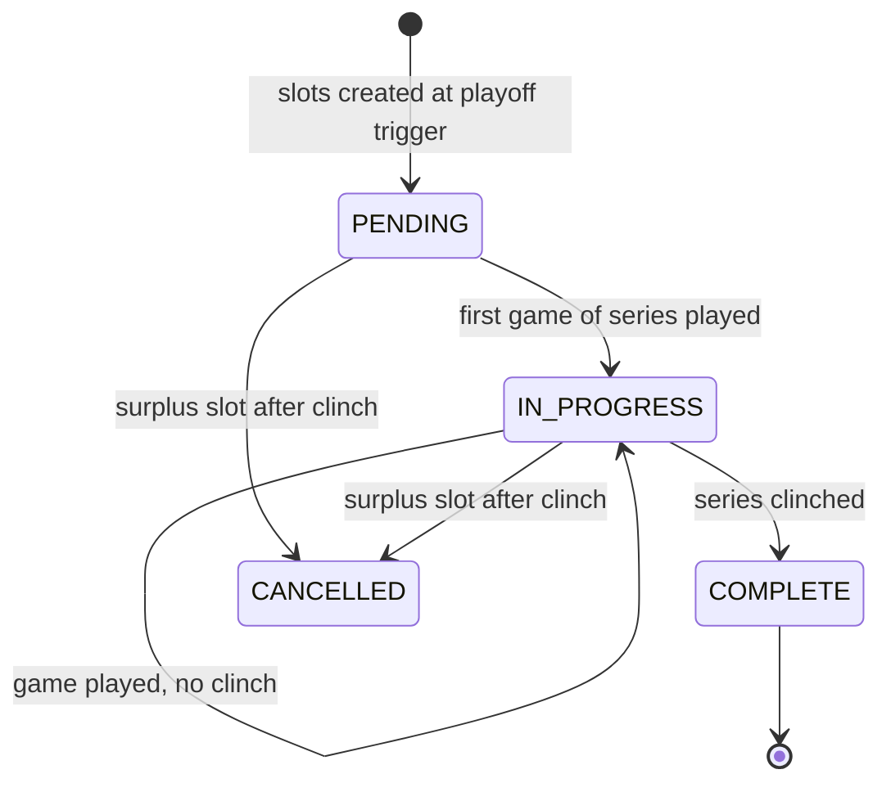

# League Mode — Playoffs

> See [README.md](README.md) for decisions log and [data-model.md](data-model.md) for the `scheduledGames` schema (playoff slots).

---

## Playoff Format Options

| Format | Series Length | Default if no choice made? |
|---|---|---|
| Bo3 | Best of 3 (first to 2 wins) | |
| Bo5 | Best of 5 (first to 3 wins) | ✅ |
| Bo7 | Best of 7 (first to 4 wins) | |

The format is stored on `LeagueSeasonRecord.playoffFormat` and set at league creation. Users who skip the playoff config step get Bo5 single-elimination.

Number of advancing teams: configurable at league creation; default = `min(4, Math.floor(teamCount / 2))`.

---

## Bracket Structure

League Mode uses a **single-elimination bracket** (the only format in v1; double-elimination is a future option).

### Seeding Rules

1. Division winners are seeded first, ordered by win percentage (best record = #1 seed).
2. If no divisions, all teams are seeded by overall win percentage.
3. Wild card teams fill remaining slots, also by win percentage.
4. Tiebreaker for equal win%: head-to-head record → run differential in H2H games → overall run differential.

### Bracket Matchup (4-team example)

```
Round 1           Final
#1 ──┐
     ├── Winner ──┐
#4 ──┘            ├── Champion
#2 ──┐            │
     ├── Winner ──┘
#3 ──┘
```

### Bracket Matchup (8-team example)

```
Round 1         Semis           Final
#1 ──┐
     ├──►       ┐
#8 ──┘          ├──►            ┐
#4 ──┐          │               ├──► Champion
     ├──►       ┘               │
#5 ──┘                          │
#2 ──┐                          │
     ├──►       ┐               │
#7 ──┘          ├──►            ┘
#3 ──┐          │
     ├──►       ┘
#6 ──┘
```

---

## Playoff Trigger

The playoff bracket is auto-generated when all regular-season games are resolved (COMPLETED or CANCELLED). The trigger fires in `scheduleStore.completeScheduledGame` after each game commit:

```ts
const allRegularDone = await scheduledGames
  .find({ selector: { leagueSeasonId, gameType: "REGULAR", status: "PENDING" } })
  .exec()
  .then((docs) => docs.length === 0);

if (allRegularDone) {
  await leagueSeasonStore.transitionToPlayoffs(leagueSeasonId);
}
```

`transitionToPlayoffs`:
1. Computes standings → seeds teams
2. Calls `generatePlayoffBracket(seeds, format)` → produces all first-round `ScheduledGameRecord` docs
3. Sets `leagueSeason.status = "PLAYOFFS"`

---

## Series Scheduling

All potential game slots for a series are created upfront as PENDING `ScheduledGameRecord` docs. Surplus slots are CANCELLED when the series is clinched.

**Bo5 example (teams A vs B — A wins 3–1):**

| Slot | Status | Winner |
|---|---|---|
| Game 1 | COMPLETED | A |
| Game 2 | COMPLETED | B |
| Game 3 | COMPLETED | A |
| Game 4 | COMPLETED | A ← series clinched |
| Game 5 | CANCELLED | — |

The clinch check runs after each game is committed:

```ts
function isSeriesClinched(
  winsNeeded: number,
  homeWins: number,
  awayWins: number,
): { clinched: boolean; winnerId?: string } {
  if (homeWins >= winsNeeded) return { clinched: true, winnerId: homeTeamId };
  if (awayWins >= winsNeeded) return { clinched: true, winnerId: awayTeamId };
  return { clinched: false };
}
```

When a series is clinched:
1. Mark remaining PENDING game slots for the series as CANCELLED.
2. Write the series winner to `PlayoffBracket` state (stored in `leagueSeason` as `bracketState`).
3. If the next round has openings filled, create the next-round game slots.
4. If the finals series is clinched, set `leagueSeason.status = "COMPLETE"` and `leagueSeason.championTeamId`.

---

## Series State Machine



Series state is derived at read-time from the `ScheduledGameRecord` docs for that `seriesId` — there is no separate "series status" document. A series is:
- **PENDING** — all slots are PENDING
- **IN_PROGRESS** — at least one slot is COMPLETED, series not yet clinched
- **COMPLETE** — one team has reached the wins-needed threshold
- **CANCELLED** (full series) — all slots are CANCELLED (team given a bye or forfeit)

---

## `PlayoffBracketPage` Layout

```
Season 1 Playoffs  ·  Best of 5

ROUND 1                 SEMIFINALS              FINAL

Hawks (1)   ┐           Hawks     ┐
  W 3 – 1   ├── Hawks ──┤          ├── Hawks ──► CHAMPION 🏆
Foxes (4)   ┘           (2-0)     │
                                   │
Comets (2)  ┐           Comets    │
  W 3 – 2   ├── Comets ─┘ (0-2)   │
Bolts  (3)  ┘
```

Series scores display as `W X – Y` (wins per team), not game scores. Tapping a series opens a `SeriesDetailModal` showing the individual game results.

---

## `playoffBracket.ts` API

```ts
interface PlayoffSeed {
  teamId: string;
  seed: number;
  wins: number;
  losses: number;
  isDivisionWinner: boolean;
}

interface PlayoffMatchup {
  seriesId: string;
  round: number;
  homeTeamId: string;  // higher seed = home team
  awayTeamId: string;
  format: PlayoffFormat;
  homeWins: number;
  awayWins: number;
  status: "PENDING" | "IN_PROGRESS" | "COMPLETE";
  winnerId: string | null;
}

interface PlayoffBracket {
  rounds: number;
  matchups: PlayoffMatchup[];
}

// Generate seedings from standings
function seedTeams(
  standings: StandingsRow[],
  divisions: DivisionRecord[],
  advancingCount: number,
): PlayoffSeed[]

// Build the full initial bracket (creates ScheduledGameRecord docs)
function generatePlayoffBracket(
  seeds: PlayoffSeed[],
  format: PlayoffFormat,
): PlayoffBracket

// Immutable update after a series clinches
function advanceBracket(
  bracket: PlayoffBracket,
  completedMatchup: PlayoffMatchup,
): PlayoffBracket
```

---

## Champion Crowning

When `leagueSeason.status` transitions to `"COMPLETE"`:

1. `LeagueDetailPage` shows a **Champion Banner** at the top with the winning team name and a trophy icon.
2. `LeagueHubPage` shows a small trophy badge on the league card alongside the champion's name.
3. The season is read-only from this point.
4. `LeagueDetailPage` shows a **"Start New Season"** button (Phase 9).

The `championTeamId` is stored on `LeagueSeasonRecord` and is permanent — it is never cleared or overwritten.
