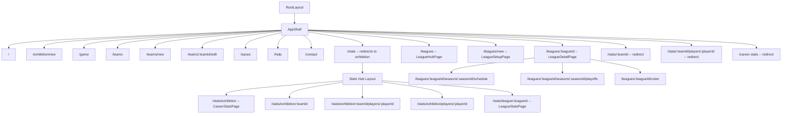

# League Mode — Route Architecture

> See [README.md](README.md) for decisions log and [implementation-plan.md](implementation-plan.md) for the full phase plan.

---

## Before / After Route Comparison

### Before (current)

```
/                          → HomeScreen
/exhibition/new            → ExhibitionSetupPage
/game                      → GamePage
/teams                     → ManageTeamsScreen
/teams/new                 → ManageTeamsScreen (create)
/teams/:teamId/edit        → ManageTeamsScreen (edit)
/saves                     → SavesPage
/help                      → HelpPage
/contact                   → ContactPage
/stats                     → CareerStatsPage  ← exhibition only
/stats/:teamId             → CareerStatsPage
/stats/:teamId/players/:playerId  → PlayerCareerPage
/stats/players/:playerId   → PlayerCareerPage
/career-stats              → redirect → /stats
```

### After (with League Mode)

```
/                          → HomeScreen  (League Mode button added)
/exhibition/new            → ExhibitionSetupPage
/game                      → GamePage
/teams                     → ManageTeamsScreen
/teams/new                 → ManageTeamsScreen (create)
/teams/:teamId/edit        → ManageTeamsScreen (edit)
/saves                     → SavesPage
/help                      → HelpPage
/contact                   → ContactPage

── Stats Hub ──────────────────────────────────────────────────────────────────
/stats                     → redirect → /stats/exhibition  ← was CareerStatsPage
/stats/exhibition          → CareerStatsPage (exhibition stats, unchanged)
/stats/exhibition/:teamId  → CareerStatsPage (team filter)
/stats/exhibition/:teamId/players/:playerId → PlayerCareerPage
/stats/exhibition/players/:playerId         → PlayerCareerPage
/stats/league/:leagueId    → LeagueStatsPage (per-league leaderboards)

── Legacy redirects (preserve existing bookmarks / deep-links) ────────────────
/career-stats              → redirect → /stats/exhibition
/stats/:teamId             → redirect → /stats/exhibition/:teamId
/stats/:teamId/players/:playerId → redirect → /stats/exhibition/:teamId/players/:playerId
/stats/players/:playerId   → redirect → /stats/exhibition/players/:playerId

── League Mode ────────────────────────────────────────────────────────────────
/leagues                                           → LeagueHubPage
/leagues/new                                       → LeagueSetupPage
/leagues/:leagueId                                 → LeagueDetailPage
/leagues/:leagueId/seasons/:seasonId/schedule      → SchedulePage
/leagues/:leagueId/seasons/:seasonId/playoffs      → PlayoffBracketPage
/leagues/:leagueId/roster                          → LeagueRosterPage (trades)
```

---

## Route Tree Diagram



---

## `router.tsx` Changes

### 1. Stats Hub layout route

Wrap all `/stats/*` children in a shared layout component (`StatsHubLayout`) that renders tab navigation (Exhibition | League):

```tsx
{
  path: "stats",
  element: <StatsHubLayout />,          // new layout component
  children: [
    { index: true, element: <Navigate to="exhibition" replace /> },
    {
      path: "exhibition",
      element: <React.Suspense fallback={null}><CareerStatsPage /></React.Suspense>,
    },
    {
      path: "exhibition/:teamId",
      element: <React.Suspense fallback={null}><CareerStatsPage /></React.Suspense>,
    },
    {
      path: "exhibition/:teamId/players/:playerId",
      element: <React.Suspense fallback={null}><PlayerCareerPage /></React.Suspense>,
    },
    {
      path: "exhibition/players/:playerId",
      element: <React.Suspense fallback={null}><PlayerCareerPage /></React.Suspense>,
    },
    {
      path: "league/:leagueId",
      element: <React.Suspense fallback={null}><LeagueStatsPage /></React.Suspense>,
    },
  ],
},
// Legacy redirects — keep /stats/:teamId working for old bookmarks
{ path: "stats/:teamId",                    element: <StatsLegacyRedirect /> },
{ path: "stats/:teamId/players/:playerId",  element: <StatsPlayerLegacyRedirect /> },
{ path: "stats/players/:playerId",          element: <Navigate to={`/stats/exhibition/players/${...}`} replace /> },
{ path: "career-stats",                     element: <Navigate to="/stats/exhibition" replace /> },
```

### 2. League routes

```tsx
{
  path: "leagues",
  element: <React.Suspense fallback={null}><LeagueHubPage /></React.Suspense>,
},
{
  path: "leagues/new",
  element: <React.Suspense fallback={null}><LeagueSetupPage /></React.Suspense>,
},
{
  path: "leagues/:leagueId",
  element: <React.Suspense fallback={null}><LeagueDetailPage /></React.Suspense>,
  loader: async ({ params }) => {
    if (!params.leagueId) return redirect("/leagues");
    return null;
  },
},
{
  path: "leagues/:leagueId/seasons/:seasonId/schedule",
  element: <React.Suspense fallback={null}><SchedulePage /></React.Suspense>,
},
{
  path: "leagues/:leagueId/seasons/:seasonId/playoffs",
  element: <React.Suspense fallback={null}><PlayoffBracketPage /></React.Suspense>,
},
{
  path: "leagues/:leagueId/roster",
  element: <React.Suspense fallback={null}><LeagueRosterPage /></React.Suspense>,
},
```

### 3. `GameLocationState` extension

`location.state` for `/game` gains an optional `leagueContext` field so the game can commit its result back to the league on `gameOver`:

```ts
// src/storage/types.ts
export type LeagueGameContext = {
  leagueId: string;
  seasonId: string;
  scheduledGameId: string;
};

export type GameLocationState = {
  pendingGameSetup: ExhibitionGameSetup | null;
  pendingLoadSave: SaveRecord | null;
  leagueContext?: LeagueGameContext;   // ← new; undefined = exhibition game
} | null;
```

---

## Navigation Convention for League IDs

League IDs are generated by `generateLeagueId()` from `@storage/generateId` (nanoid-based, URL-safe by construction). For consistency with the existing pattern for team IDs, always `encodeURIComponent` any ID used as a URL path segment when building navigation URLs. This protects against any future ID format changes.

```ts
// ✅ Correct
navigate(`/leagues/${encodeURIComponent(leagueId)}`);

// ❌ Wrong — assumes ID is URL-safe forever
navigate(`/leagues/${leagueId}`);
```

---

## AppShellOutletContext Extension

Add a League Mode navigation callback to the outlet context:

```ts
export type AppShellOutletContext = {
  // ... existing fields unchanged ...
  onLeagues: () => void;   // ← new; navigates to /leagues
};
```

`HomeScreen` gains a "League Mode" / "My Leagues" button that calls `ctx.onLeagues`.
