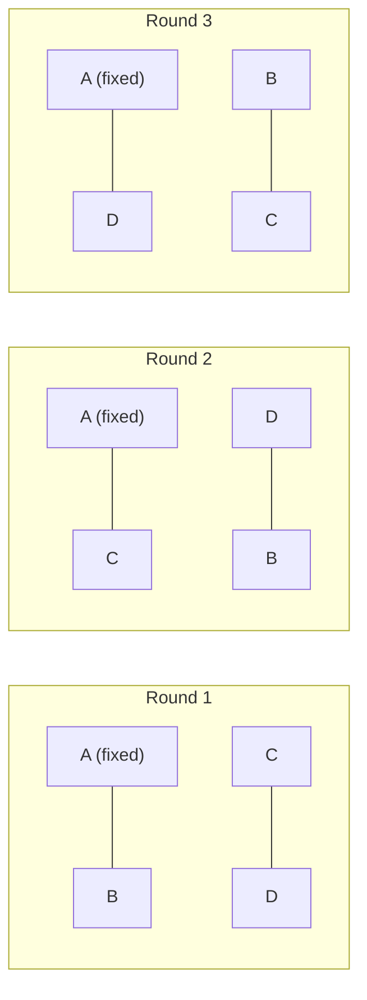
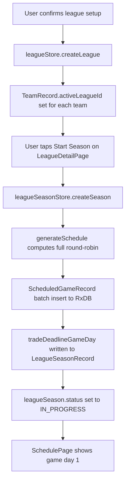

# League Mode — Schedule Algorithm

> See [README.md](README.md) for decisions log and [implementation-plan.md](implementation-plan.md) for Phase 2 checklist.

---

## The Core Questions

> *How are game days created? Randomly? Is there a schedule before the season starts? Are there 3–4 game series or one-off games? How is the season scheduled?*

**Short answers:**

- Yes — the **full schedule is generated upfront** before the first game is played, stored as `ScheduledGameRecord` docs. Nothing is random at schedule time; the algorithm is deterministic given the same team list and season length.
- Games are grouped into **series** (default: 3 games per series) between pairs of teams. A "game day" is all games scheduled on the same `gameDay` integer. A series occupies consecutive game days.
- The schedule is produced by a **round-robin rotation algorithm** (the "circle method"), extended to fill the target game count and grouped into series.

---

## Series vs. One-Off Games

League Mode uses **series-based scheduling** by default, not isolated single games.

| Concept | Value |
|---|---|
| Default series length | 3 games |
| Configurable range | 1 (one-off) to 7 (Bo7 regular season) |
| Set at | League creation (`LeagueRecord.defaultSeriesLength`) |
| Games on one "game day" | One game from each active series — all matchups for that calendar day |

A series of 3 means teams A and B play 3 games back-to-back before rotating to their next opponent. This mirrors how real baseball is played (a "series" is the fundamental unit, not individual games) and makes the Simulate Day feature coherent — one tap advances a full calendar day worth of games across all active series.

### Example: 4-team league, 3-game series

```
Day 1   A vs B (game 1 of 3)    C vs D (game 1 of 3)
Day 2   A vs B (game 2 of 3)    C vs D (game 2 of 3)
Day 3   A vs B (game 3 of 3)    C vs D (game 3 of 3)
Day 4   A vs C (game 1 of 3)    B vs D (game 1 of 3)
Day 5   A vs C (game 2 of 3)    B vs D (game 2 of 3)
Day 6   A vs C (game 3 of 3)    B vs D (game 3 of 3)
Day 7   A vs D (game 1 of 3)    B vs C (game 1 of 3)
...
```

Each "Simulate Day" button press advances one row in this table.

---

## The Round-Robin Rotation Algorithm (Circle Method)

The foundation is the classic **circle / polygon rotation** algorithm, which produces a perfectly balanced round-robin tournament schedule where every team plays every other team exactly once per "round."

### Circle-Method Diagram (4 teams)

Each round, team A stays fixed while B, C, D rotate one position counter-clockwise. The lines show which pairs play each other.



After three rounds every team has faced every other team exactly once — a complete single pass. To build a full season, passes are repeated (alternating home/away) until the game-count target is met.

### How it works

Given `n` teams (assume `n` is even; see Bye Handling for odd `n`):

1. Fix one team (e.g. team at index 0) in position. Call the remaining `n-1` teams the "rotation."
2. For each round `r` from `0` to `n-2`:
   - Pair the fixed team with `rotation[r]`.
   - Pair `rotation[(r+1) % (n-1)]` with `rotation[(r + n - 2) % (n-1)]`.
   - Pair `rotation[(r+2) % (n-1)]` with `rotation[(r + n - 3) % (n-1)]`, and so on.
   - This produces `n/2` matchups per round.
3. After `n-1` rounds, every team has played every other team exactly once. This is one **full pass**.
4. Alternate home/away for each matchup in a second pass (flip `homeTeamId` and `awayTeamId`).
5. Repeat passes until the total game count per team reaches or exceeds the season target.

### Pseudocode

```ts
function generateRoundRobinPasses(teamIds: string[]): MatchupPair[][] {
  const n = teamIds.length;
  const fixed = teamIds[0];
  const rotation = teamIds.slice(1);         // length n-1
  const rounds: MatchupPair[][] = [];

  for (let r = 0; r < n - 1; r++) {
    const round: MatchupPair[] = [];

    // Fixed team vs. rotation[r]
    round.push({ home: fixed, away: rotation[r] });

    // Remaining pairs
    for (let i = 1; i < n / 2; i++) {
      const home = rotation[(r + i) % (n - 1)];
      const away = rotation[(r + n - 1 - i) % (n - 1)];
      round.push({ home, away });
    }

    rounds.push(round);
  }

  return rounds;  // one full pass: n-1 rounds, each with n/2 matchups
}
```

### Full `generateSchedule` logic

```ts
function generateSchedule(options: GenerateScheduleOptions): ScheduledGameSlot[] {
  const { teamIds, gamesPerTeam, seriesLength, divisionWeightedSchedule, divisions } = options;

  // 1. Compute how many times each matchup appears
  const matchupCounts = computeMatchupCounts({
    teamIds, gamesPerTeam, seriesLength, divisionWeightedSchedule, divisions,
  });
  //    matchupCounts is a Map<`${teamA}:${teamB}`, number>
  //    Each entry = how many series to schedule for that pair

  // 2. Build ordered list of matchups to schedule (series, with home/away)
  const seriesOrder = buildSeriesOrder(teamIds, matchupCounts);
  //    Uses round-robin rotation to interleave matchups evenly

  // 3. Convert series to game slots with gameDay integers
  return assignGameDays(seriesOrder, seriesLength);
  //    Each series occupies `seriesLength` consecutive game days
  //    Multiple matchups run in parallel on the same gameDay
}
```

---

## Bye Handling (Odd Number of Teams)

When the league has an **odd** number of teams, one team sits out each round (gets a "bye"). The bye team still appears in `teamIds` — it just has no opponent for that round's game day.

**Implementation:** pad the team list with a sentinel `BYE_TEAM_ID = "bye"` to make it even, run the circle method normally, then strip any `MatchupPair` that includes `BYE_TEAM_ID` from the output. The bye team gets an extra game day off, which is accounted for in the total game count calculation.

```ts
function padToEven(teamIds: string[]): string[] {
  return teamIds.length % 2 === 0
    ? teamIds
    : [...teamIds, BYE_TEAM_ID];
}
```

Bye distribution is deterministic — the fixed team in the circle method always has the same position, so the same team doesn't always get the bye. Shuffling `teamIds` by `leagueId` seed before padding ensures bye distribution varies by league.

---

## Matchup Count Calculation

### Flat (no divisions)

Target: `gamesPerTeam` games total per team.

```ts
const totalMatchups = (n * (n - 1)) / 2;          // unique pairs
const seriesPerMatchup = Math.round(gamesPerTeam / (n - 1) / seriesLength);
// Then: actual games per team = seriesPerMatchup * seriesLength * (n-1)
// Adjust seriesPerMatchup ± 1 until actual games per team ≈ gamesPerTeam
```

If `gamesPerTeam` isn't exactly divisible, some matchups get one extra series. These are distributed by seeding a shuffle of matchup pairs (so the "extra" games fall on different matchups each season).

### Division-Weighted

When `divisionWeightedSchedule: true`:

- Division-rival pairs get `inDivisionSeriesCount` series.
- Inter-division pairs get `interDivisionSeriesCount` series.
- Ratio target: in-division games ≈ 1.4× inter-division games per team (mirrors MLB).

```
inDivisionSeriesCount  = Math.round(interDivisionSeriesCount * 1.4)
```

The exact counts are solved to satisfy `gamesPerTeam` as closely as possible given the team/division counts.

| League config | In-division ratio |
|---|---|
| 2 divisions of 4 | each team plays 4 division rivals, 4 inter-division rivals |
| 4 divisions of 2 | each team plays 2 division rivals, 6 inter-division rivals |

---

## Game Day Assignment

Once the ordered series list is built, game days are assigned left-to-right:

```
Series 1 (A vs B, 3 games):  gameDay 1, 2, 3
Series 1 (C vs D, 3 games):  gameDay 1, 2, 3   ← runs in parallel
Series 2 (A vs C, 3 games):  gameDay 4, 5, 6
Series 2 (B vs D, 3 games):  gameDay 4, 5, 6   ← runs in parallel
...
```

The maximum number of parallel series on any game day is `floor(n / 2)` (one series per pair of teams, since each team can only play one game per day). Game days are assigned so no team plays on two different series on the same day.

### Complete 4-team schedule (12 games per team, 3-game series)

With 4 teams and `gamesPerTeam = 12` (2 series per matchup pair, home/away swapped between passes):

| Game Days | Left matchup | Right matchup (parallel) |
|---|---|---|
| Days 1–3 | A vs B — series 1 | C vs D — series 1 |
| Days 4–6 | A vs C — series 1 | B vs D — series 1 |
| Days 7–9 | A vs D — series 1 | B vs C — series 1 |
| Days 10–12 | B vs A — series 2 (H/A flipped) | D vs C — series 2 |
| Days 13–15 | C vs A — series 2 | D vs B — series 2 |
| Days 16–18 | D vs A — series 2 | C vs B — series 2 |

Total: **18 game days**, 12 games per team, 2 parallel matchups per day. Each "Simulate Day" press advances one row.

---

## Season Presets and Series Length

| Preset | Games/team | Typical series | Total game days (4 teams) | Total game days (8 teams) |
|---|---|---|---|---|
| Quick | 10 | 3 | ~21 | ~15 |
| Short | 30 | 3 | ~60 | ~45 |
| Standard | 60 | 3 | ~120 | ~90 |
| Full | 162 | 3 | ~324 | ~243 |
| Custom | user | user | varies | varies |

*Game days are approximate — exact count depends on series length and team count.*

---

## `generateSchedule` TypeScript API

```ts
export interface GenerateScheduleOptions {
  teamIds: string[];
  leagueSeasonId: string;
  leagueId: string;
  gamesPerTeam: number;
  seriesLength: number;          // default 3; min 1, max 7
  divisionWeightedSchedule: boolean;
  divisions: DivisionRecord[];   // empty array = no divisions
  /** Seed for deterministic tie-breaking when distributing "extra" series.
   *  Use leagueSeasonId so each season produces a slightly different schedule. */
  seed: string;
}

export interface ScheduledGameSlot {
  homeTeamId: string;
  awayTeamId: string;
  gameDay: number;              // 1-based
  seriesId: string;             // e.g. "sg_teamA_teamB_1"
  seriesGameNumber: number;     // 1, 2, or 3 within the series
  leagueSeasonId: string;
  leagueId: string;
  gameType: "REGULAR";
}

export function generateSchedule(options: GenerateScheduleOptions): ScheduledGameSlot[];
```

The output of `generateSchedule` is converted directly into `ScheduledGameRecord` docs by `leagueSeasonStore.createSeason`, which writes them all to RxDB in a single batch at season creation time.

---

## Season Creation Pipeline

The full schedule is generated and persisted in one shot when the user starts a season. Nothing is lazy or deferred.



---

## Game Seed Uniqueness

Every simulated game — including games run in bulk via Simulate Day — must use a **unique, deterministic seed** so that:

1. The same game always produces the same result when re-simulated (replay verification, crash recovery).
2. No two games in a batch share a seed, preventing any cross-game RNG correlation.

### Seed formula

```ts
const seed = `${leagueSeasonId}:${scheduledGameId}`;
```

**Why this is guaranteed unique within a season:**  
`scheduledGameId` is an RxDB primary key (`sg_<fnv1a hash>`). RxDB enforces primary key uniqueness at the collection level — no two `ScheduledGameRecord` docs in the same collection can share an ID. Therefore no two games in the same season can produce the same seed string.

**Why this is guaranteed unique across seasons:**  
The `leagueSeasonId` prefix (`ls_<fnv1a hash>`) differs for every season. Even in the astronomically unlikely event that two different seasons produce a `scheduledGameId` collision, their seed strings would still differ.

**Why this is safe for batched simulation:**  
`headlessSim` is a pure function — it takes a seed, runs the reducer loop, and returns a result with no shared mutable state. Running multiple calls in the same event loop tick is safe because each call seeds its own PRNG independently from the formula above. There is no global RNG state shared between parallel simulations.

**Playoff games:**  
Playoff `ScheduledGameRecord` docs are generated with the same `generateScheduledGameId()` function, so playoff game seeds are guaranteed unique by the same mechanism.

### Seed storage

The computed seed is passed into `headlessSim` and stored verbatim on the resulting `CompletedGameRecord.seed`. This allows any game result to be re-verified by re-running `headlessSim` with the same seed and comparing outputs.

---

## Trade Deadline Game Day

The trade deadline game day is computed from the schedule at creation time:

```ts
const tradeDeadlineGameDay = Math.floor(totalGameDays / 2);
```

`totalGameDays` is the highest `gameDay` value across all generated `ScheduledGameSlot`s. The deadline falls at the midpoint of the season calendar (not the midpoint of games played, since days advance at the user's pace).

---

## Unit Test Cases

| Test | What to verify |
|---|---|
| 4 teams, Quick (12 games), seriesLength=3 | Every team plays exactly 12 games; no team plays itself; home/away balanced ±1 per matchup pair |
| 5 teams (odd), Quick | Bye team never paired against itself; total games per team is within ±3 of target |
| 8 teams, 2 divisions, Standard (60), division weighted | In-division games ~1.4× inter-division per team |
| 4 teams, seriesLength=1 (one-off) | Every game has a unique matchup per round; no series IDs repeated within a round |
| Seed stability | Same inputs + same seed → identical `ScheduledGameSlot[]` output (deterministic) |
| Game day parallelism | No team appears twice on the same `gameDay` |
| Batch seed uniqueness | Every `ScheduledGameSlot` in a Simulate Day batch has a distinct `${leagueSeasonId}:${scheduledGameId}` seed — no two seeds are equal |
| Cross-season seed isolation | Same `scheduledGameId` in two different seasons produces different seeds due to distinct `leagueSeasonId` prefix |
