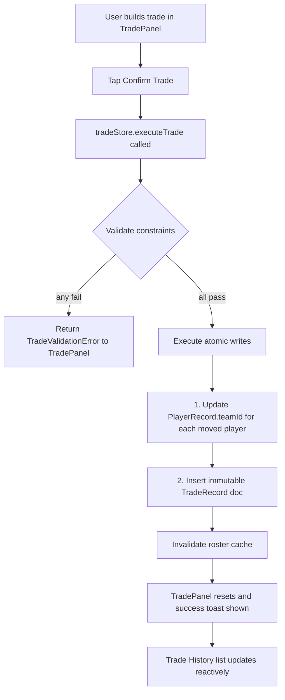

# League Mode — Trade System

> ⏭ **Future Phase (Phase 8)** — Trade functionality is not part of the initial league-mode implementation. This document is reference material for when trades are built. See [README.md](README.md) for the staged roadmap.

> See [README.md](README.md) for decisions log and [data-model.md](data-model.md) for the `tradeRecords` schema.

---

## Overview

Trades allow teams within the same league season to swap players before the trade deadline. A trade is permanent, audited (the `TradeRecord` is immutable), and requires both teams to remain valid post-trade.

---

## Trade Deadline

The deadline is a **game day number** stored on `LeagueSeasonRecord.tradeDeadlineGameDay`.

| Default | `Math.floor(totalGameDays / 2)` |
|---|---|
| Adjustable? | Yes — user sets it at league creation, or accepts the default |
| Minimum | Game day 2 |
| Maximum | `gamesPerTeam - 1` (at least one game must remain after the deadline) |

Once `leagueSeason.currentGameDay > tradeDeadlineGameDay`:
- `LeagueRosterPage` shows a **"Trade Deadline Passed"** banner in place of the trade UI
- `tradeStore.executeTrade` also validates this server-side and throws if violated

---

## Trade Constraints

All constraints are validated in `tradeStore.executeTrade` before any writes. Validation failures must return a typed `TradeValidationError` rather than a generic exception, so the UI can display a specific message.

| Constraint | Rule | Error message |
|---|---|---|
| Deadline | `currentGameDay <= tradeDeadlineGameDay` | "The trade deadline has passed for this season." |
| Same league | Both `fromTeamId` and `toTeamId` are in `leagueSeason.teamIdsAtStart` | "One or both teams are not in this league." |
| Different teams | `fromTeamId !== toTeamId` | "A team cannot trade with itself." |
| No active game | Neither team has a PENDING `ScheduledGameRecord` for `currentGameDay` that is flagged for Watch (i.e. it's currently being played live) | "Cannot trade while a live game is in progress." |
| Roster minimum — batters | Each team must have ≥ 9 batters (lineup + bench) after the trade | "Trade would leave [Team] with fewer than 9 batters." |
| Roster minimum — pitchers | Each team must have ≥ 1 pitcher after the trade | "Trade would leave [Team] with no pitchers." |
| Non-empty | `playerMoves.length >= 1` | "A trade must include at least one player." |
| Player ownership | Every player being moved actually belongs to the `fromTeamId` at time of trade | "Player [name] is not on [Team]'s roster." |

---

## Execution Flow



### Atomicity Note

RxDB does not support multi-collection transactions. The writes in steps G and H are separate. To handle a partial failure (e.g. player update succeeds but trade record insert fails):

- Always write the `TradeRecord` **last**. If the trade record is absent, the UI treats the trade as if it never happened — the player updates are the "committed" state, so they take precedence.
- On next app load, a consistency check function (`validateLeagueRosterIntegrity`) should detect any orphaned player moves (player is on a new team but no `TradeRecord` exists) and write a recovery `TradeRecord` with `source: "recovery"` for audit purposes.

---

## `TradePanel` Component

The trade UI lives at `/leagues/:leagueId/roster`.

```
┌─────────────────────────────────────────────────────────┐
│  Trade Center  ·  Season 1  ·  Deadline: After Day 30   │
├────────────────────────┬────────────────────────────────┤
│  Team A: Hawks         │  Team B: (pick a team ▼)       │
├────────────────────────┼────────────────────────────────┤
│  Gives:                │  Receives:                     │
│  [ ] Rivera, J. (SP)  │                                │
│  [ ] Smith, K. (CF)   │  Gives:                        │
│  [x] Patel, G. (1B) ──┼──► [ ] Jones, M. (SS)         │
│                        │  [x] Wu, L. (RP) ────────────► │
├────────────────────────┴────────────────────────────────┤
│  Patel, G.  →  Team B                                   │
│  Wu, L.     →  Team A                                   │
│                                     [Cancel] [Confirm]  │
└─────────────────────────────────────────────────────────┘
```

**Interaction model:**
1. User selects Team B from a dropdown (excludes Team A and any team with a live game in progress)
2. Both teams' full rosters are shown in columns
3. User clicks players to toggle them into the "Gives" pile — players move to a summary row at the bottom
4. The summary row updates the post-trade roster counts in real time and highlights any constraint violations in red
5. "Confirm" is disabled if any constraint is violated

---

## Trade History

A read-only list of `TradeRecord` docs, sorted descending by `createdAt`, shown as a collapsible section below the `TradePanel`:

```
Trade History
─────────────────────────────────────────
Day 12  ·  Hawks ↔ Wolves
  Patel, G. (1B)  →  Wolves
  Wu, L. (RP)     →  Hawks

Day 8   ·  Comets ↔ Bolts
  Jones, M. (SS)  →  Bolts
  Rivera, J. (SP) →  Comets
```

The history is queryable from `tradeRecords` collection filtered by `leagueSeasonId`.

---

## `tradeStore` API

```ts
interface TradeInput {
  leagueSeasonId: string;
  leagueId: string;
  fromTeamId: string;
  toTeamId: string;
  playerMoves: Array<{
    playerId: string;
    nameAtTradeTime: string;
    fromTeamId: string;
    toTeamId: string;
  }>;
  gameDayAtTrade: number;
}

type TradeValidationError = {
  type: "TRADE_VALIDATION_ERROR";
  code:
    | "DEADLINE_PASSED"
    | "SAME_TEAM"
    | "NOT_IN_LEAGUE"
    | "ACTIVE_GAME"
    | "ROSTER_MIN_BATTERS"
    | "ROSTER_MIN_PITCHERS"
    | "EMPTY_TRADE"
    | "PLAYER_NOT_ON_TEAM";
  message: string;
};

tradeStore.executeTrade(input: TradeInput): Promise<void | TradeValidationError>
tradeStore.getTradeHistory(leagueSeasonId: string): Promise<TradeRecord[]>
```
